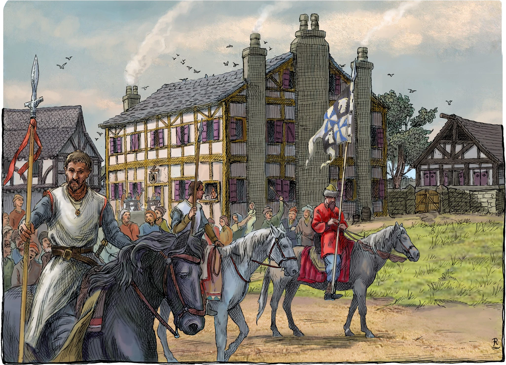

# HârnWorld Location Module: The Standing Bear Inn

The Standing Bear Inn is a "Location Module" for the Foundry VTT system. It is designed to depict the Standing Bear Inn in the city of Olokand, kingdom of Kaldor, on the island of Hârn in the [HârnWorld](https://columbiagames.com/harnworld/) fantasy setting; however, this Inn could be adapted to exist anywhere in any fantasy setting.

This module was designed for use with the [HârnMaster](https://foundryvtt.com/packages/hm3) system, but is mostly system agnostic so it can be used with any system (except the Actors, which are specific to the HârnMaster system).

**Note:** Some scenes in this module have been designed to work with the [Levels](https://foundryvtt.com/packages/levels) and [Better Roofs](https://foundryvtt.com/packages/betterroofs) modules, but these modules are not required; versions of the scenes have been provided that will work with the Foundry VTT system without these additional modules.

# Credits

**Writers:** Rob Barnes, Kerry Mould

**Artist:** Richard Luschek

**Plans:** Kerry Mould

**Editing and Layout:** Brent Bailey

**Conversion to Foundry VTT:** Tom Rodriguez, Stephen Cooper

This module is a fan-written expension of Olokand ([COL #5618](https://secure.columbiagames.com/product/5618-PDF)). 

The origial article for this module can be found on Lythia.com at [The Standing Bear Inn](https://www.lythia.com/harnworld/guilds-trade/the-standing-bear-inn/).

The characters in this module are taken from “Friends, Foes, and Followers, Part 16 Standing Bear Inn” on Lythia.com (https://www.lythia.com/game_aides/friends-foes-followers-part-16-the-standing-bear-inn/), by Kerry Mould and Rob Barnes, with illustrations by Richard Luscheck (sponsored by Rob Barnes and Patrick Nilsson).

Some of the scenes in this module include assets from [Forgotten Adventures](https://www.forgotten-adventures.net/), used with permission.

This module is "[Fanon](https://www.lythia.com/about/publishing-fan-written-material/)", a derivative work of copyrighted material by Columbia Games Inc. and N. Robin Crossby.
